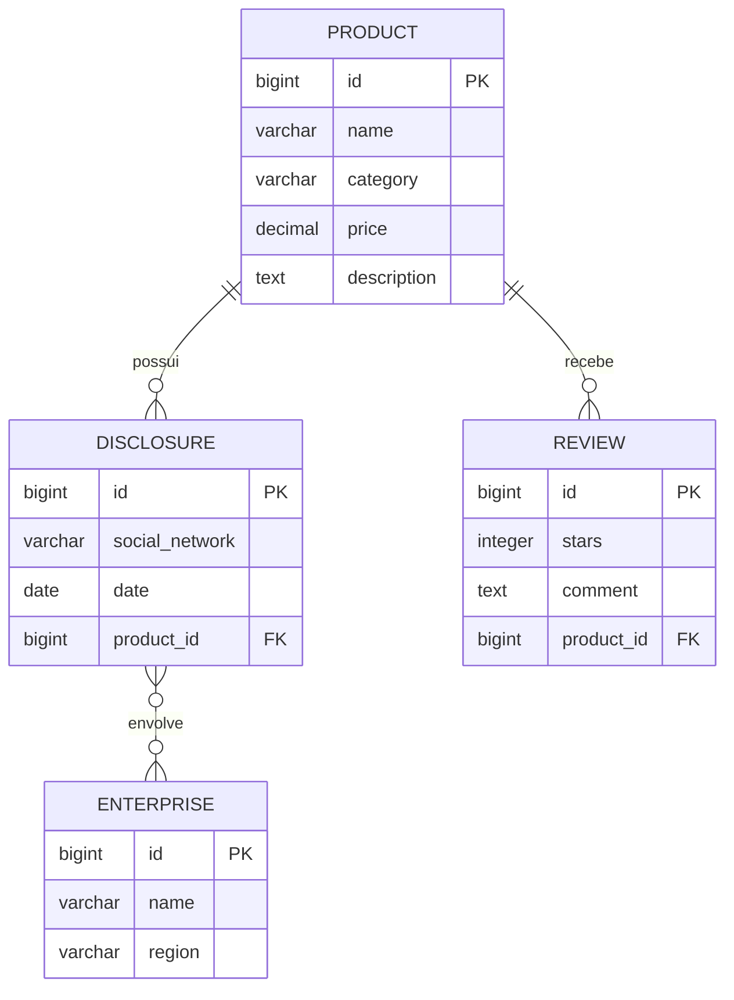

# API de Produtos, Empresas, Divulgações e Avaliações

API REST desenvolvida como projeto de aprendizado de **Django** e **Django REST Framework**. A aplicação permite cadastrar produtos e empresas, registrar a divulgação de produtos em redes sociais e criar avaliações com notas de 0 a 5 estrelas.

## Funcionalidades

- CRUD completo de produtos;
- CRUD completo de empresas;
- CRUD completo de divulgações;
- CRUD completo de avaliações;
- relacionamento entre produtos, divulgações e avaliações;
- relacionamento de muitos para muitos entre divulgações e empresas;
- validação da nota das avaliações;
- interface administrativa do Django;
- API navegável fornecida pelo Django REST Framework.

## Tecnologias

- Python 3.12 ou superior;
- Django 6.1.1;
- Django REST Framework 3.18.1;
- SQLite;
- ASGI e WSGI.

As versões exatas das dependências estão registradas em `requirements.txt`.

## Modelo de dados



### Produto

| Campo | Tipo | Obrigatório | Regras |
|---|---|---:|---|
| `id` | inteiro | automático | Chave primária |
| `name` | texto | sim | Até 200 caracteres |
| `category` | texto | sim | Até 50 caracteres |
| `price` | decimal | não | Até 10 dígitos, com 2 casas decimais |
| `description` | texto | não | Descrição livre |

### Empresa

| Campo | Tipo | Obrigatório | Regras |
|---|---|---:|---|
| `id` | inteiro | automático | Chave primária |
| `name` | texto | sim | Até 200 caracteres |
| `region` | texto | não | Deve usar um dos valores aceitos abaixo |

Valores aceitos para `region`:

| Valor enviado | Região |
|---|---|
| `REGION_NORTH` | Norte |
| `REGION_NORTH_EAST` | Nordeste |
| `REGION_CENTRAL_WEST` | Centro-Oeste |
| `REGION_SOUTHEAST` | Sudeste |
| `REGION_SOUTH` | Sul |

### Divulgação

| Campo | Tipo | Obrigatório | Regras |
|---|---|---:|---|
| `id` | inteiro | automático | Chave primária |
| `social_network` | texto | sim | Deve usar um dos valores aceitos abaixo |
| `date` | data | não | Formato `AAAA-MM-DD` |
| `product` | inteiro | não | ID de um produto existente |
| `enterprise` | lista de inteiros | sim | IDs de empresas existentes |

Valores aceitos para `social_network`: `INSTAGRAM`, `FACEBOOK`, `YOUTUBE`, `TIK_TOK`, `X`, `WHATSAPP` e `KAWAI`.

Uma divulgação pode envolver várias empresas, e uma empresa pode participar de várias divulgações. Cada divulgação pode estar associada a um produto.

### Avaliação

| Campo | Tipo | Obrigatório | Regras |
|---|---|---:|---|
| `id` | inteiro | automático | Chave primária |
| `product` | inteiro | não | ID de um produto existente |
| `stars` | inteiro | sim | Valor entre 0 e 5 |
| `comment` | texto | não | Comentário livre |

O banco impede a exclusão de um produto que ainda esteja relacionado a uma divulgação ou avaliação.

## Como executar o projeto

### 1. Clonar o repositório

```bash
git clone <URL_DO_REPOSITORIO>
cd learning_to_create_APIs
```

### 2. Criar e ativar um ambiente virtual

No Linux ou macOS:

```bash
python3 -m venv venv
source venv/bin/activate
```

No Windows (PowerShell):

```powershell
py -m venv venv
venv\Scripts\Activate.ps1
```

### 3. Instalar as dependências

```bash
python -m pip install -r requirements.txt
```

### 4. Criar o banco de dados

```bash
python manage.py migrate
```

### 5. Iniciar o servidor

```bash
python manage.py runserver
```

A API ficará disponível em `http://127.0.0.1:8000/api/v1/`.

## Endpoints

| Recurso | Método | Endpoint | Ação |
|---|---|---|---|
| Produtos | `GET` | `/api/v1/products/` | Listar produtos |
| Produtos | `POST` | `/api/v1/products/` | Criar produto |
| Produtos | `GET` | `/api/v1/products/{id}/` | Consultar produto |
| Produtos | `PUT` / `PATCH` | `/api/v1/products/{id}/` | Atualizar produto |
| Produtos | `DELETE` | `/api/v1/products/{id}/` | Excluir produto |
| Empresas | `GET` | `/api/v1/enterprise/` | Listar empresas |
| Empresas | `POST` | `/api/v1/enterprise/` | Criar empresa |
| Empresas | `GET` | `/api/v1/enterprise/{id}/` | Consultar empresa |
| Empresas | `PUT` / `PATCH` | `/api/v1/enterprise/{id}/` | Atualizar empresa |
| Empresas | `DELETE` | `/api/v1/enterprise/{id}/` | Excluir empresa |
| Divulgações | `GET` | `/api/v1/disclosure/` | Listar divulgações |
| Divulgações | `POST` | `/api/v1/disclosure/` | Criar divulgação |
| Divulgações | `GET` | `/api/v1/disclosure/{id}/` | Consultar divulgação |
| Divulgações | `PUT` / `PATCH` | `/api/v1/disclosure/{id}/` | Atualizar divulgação |
| Divulgações | `DELETE` | `/api/v1/disclosure/{id}/` | Excluir divulgação |
| Avaliações | `GET` | `/api/v1/review/` | Listar avaliações |
| Avaliações | `POST` | `/api/v1/review/` | Criar avaliação |
| Avaliações | `GET` | `/api/v1/review/{id}/` | Consultar avaliação |
| Avaliações | `PUT` / `PATCH` | `/api/v1/review/{id}/` | Atualizar avaliação |
| Avaliações | `DELETE` | `/api/v1/review/{id}/` | Excluir avaliação |

Os endpoints de listagem retornam todos os registros, pois o projeto ainda não configura paginação.

## Exemplos de requisições

Os exemplos abaixo consideram o servidor em execução no endereço padrão.

### Criar um produto

```bash
curl -X POST http://127.0.0.1:8000/api/v1/products/ \
  -H "Content-Type: application/json" \
  -d '{
    "name": "Café Especial",
    "category": "Bebidas",
    "price": "29.90",
    "description": "Café torrado em grãos"
  }'
```

### Criar uma empresa

```bash
curl -X POST http://127.0.0.1:8000/api/v1/enterprise/ \
  -H "Content-Type: application/json" \
  -d '{
    "name": "Empresa Exemplo",
    "region": "REGION_SOUTHEAST"
  }'
```

### Criar uma divulgação

Neste exemplo, o produto de ID `1` é divulgado por duas empresas, com IDs `1` e `2`:

```bash
curl -X POST http://127.0.0.1:8000/api/v1/disclosure/ \
  -H "Content-Type: application/json" \
  -d '{
    "social_network": "INSTAGRAM",
    "date": "2026-09-21",
    "product": 1,
    "enterprise": [1, 2]
  }'
```

### Criar uma avaliação

```bash
curl -X POST http://127.0.0.1:8000/api/v1/review/ \
  -H "Content-Type: application/json" \
  -d '{
    "product": 1,
    "stars": 5,
    "comment": "Produto excelente!"
  }'
```

### Atualizar parcialmente um produto

```bash
curl -X PATCH http://127.0.0.1:8000/api/v1/products/1/ \
  -H "Content-Type: application/json" \
  -d '{"price": "24.90"}'
```

### Excluir uma avaliação

```bash
curl -X DELETE http://127.0.0.1:8000/api/v1/review/1/
```

## Administração

Os quatro modelos estão registrados no painel administrativo do Django. Para utilizá-lo, crie um superusuário:

```bash
python manage.py createsuperuser
```

Depois, acesse `http://127.0.0.1:8000/admin/` e entre com as credenciais criadas.

## Testes

Para executar a suíte de testes:

```bash
python manage.py test
```

Os arquivos de testes já existem em cada aplicação, mas o projeto ainda não possui casos de teste automatizados implementados.

## Estrutura do projeto

```text
.
├── app/                    # Configurações, URLs principais, ASGI e WSGI
├── disclosure/             # Divulgações e seus relacionamentos
├── enterprise/             # Empresas e regiões
├── products/               # Produtos
├── review/                 # Avaliações dos produtos
├── manage.py               # Utilitário de linha de comando do Django
└── requirements.txt        # Dependências fixadas do projeto
```

Cada aplicação segue a organização convencional do Django:

- `models.py`: define as tabelas e os relacionamentos;
- `serializers.py`: converte modelos de e para JSON e aplica validações;
- `views.py`: implementa as operações CRUD com views genéricas do DRF;
- `urls.py`: declara as rotas do recurso;
- `admin.py`: registra os modelos no painel administrativo;
- `migrations/`: mantém o histórico do esquema do banco;
- `tests.py`: concentra os testes automatizados da aplicação.

## Estado atual e uso em produção

O projeto está configurado para desenvolvimento e aprendizado. Atualmente, a API não exige autenticação, não define permissões específicas e utiliza SQLite. Antes de publicar em produção, é importante:

- mover a `SECRET_KEY` para uma variável de ambiente;
- desativar `DEBUG`;
- configurar `ALLOWED_HOSTS`;
- definir autenticação e permissões para os endpoints;
- configurar paginação, tratamento de erros e logs;
- utilizar um banco de dados apropriado para o ambiente;
- adicionar testes automatizados;
- servir arquivos estáticos e a aplicação com uma infraestrutura adequada.
